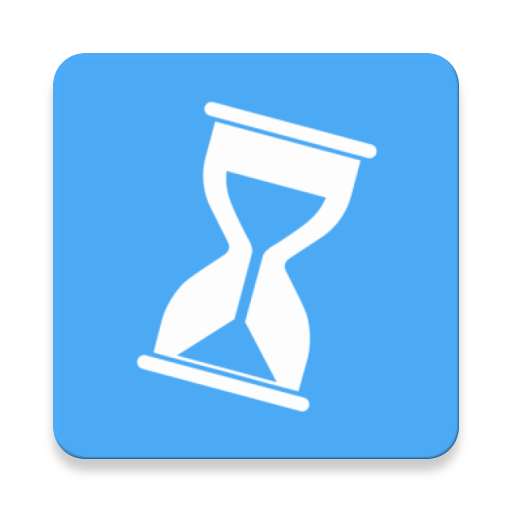
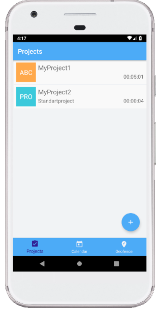
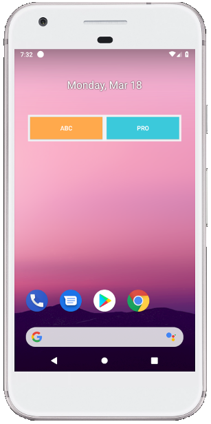
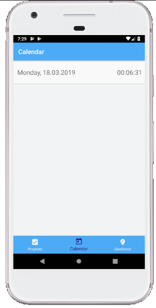
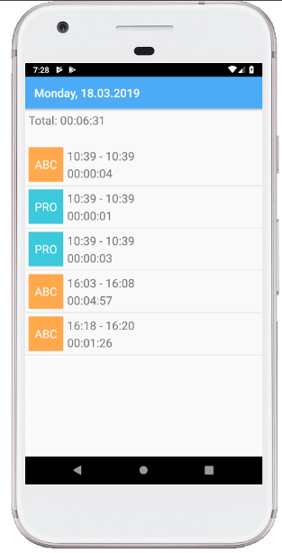
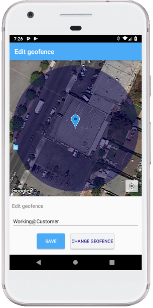

# EazyTime App   

[](https://travis-ci.com/StephGit/EazyTime)

Simple time tracking app for Android in Kotlin.

##### Table of Contents
[What is it?](#what-is-it)<br>
[Technologies](#technologies)<br>
[Getting Started](#getting-started)<br>


## What is it?

Android-App to detect when I arrived or left the office with help of geofences. In addition, I can manage my working hours manually and assign different projects. The app allows me to view my working hours of the past few days.

### Project View

Add your projects to book working time on them. 



For each project you can define a name, shortcode and set if it should be displayed on the widget.
Up to five projects can be displayed on the widget and as well on a LockScreenNotification. With the LockScreenNotification you can start/stop bookings even without unlocking your device.
You have the possibility to set one default project, which will be triggered on entering a geofence. 



### Calendar View

Simple overview of your bookings. Shows days with a total of booked time: 



 And a detail view per day with the booked time slots per project.



### Geofence View

Allows you to add geofences for your working areas. As soon you enter a active geofence, your default project is triggered. If there's already a running project nothing happens. Leaving a geofence ends the booking on the current running project.




## Technologies

Project is migrated to AndroidX. Find more information about [AndroidX here](https://android-developers.googleblog.com/2018/05/hello-world-androidx.html). 

- Android SDK v28 (min v21)
- Kotlin 1.3.21
- Dagger 2.20 
- Lifecycle 2.2.0
- Room 2.0.0
- Coroutines 1.1.1

## Getting Started

The app is not released yet, so you have to build a debug apk. 
Download the app by cloning this repository and use the `gradlew installDebug` command to build and install the project directly on your connected device or running emulator.

### GoogleMap and Places API

The app uses Google Maps and Places API for the geofence-feature. If you want to use this feature, you need to get your own API-Key from [Google Cloud Platforms](https://cloud.google.com/maps-platform/).
Make sure to register your API key for **Maps SDK for Android** and **Places API**.

Add the key to the resource-file `google_api.xml` by replacing **YOUR_API_KEY** with the value of your API key.
```
<?xml version="1.0" encoding="utf-8"?>
<resources>
    <string name="google_api_key" translatable="false" templateMergeStrategy="preserve">
        YOUR_API_KEY
    </string>
</resources>
```

### Connect your device 

Follow these steps to connect your device:

1. Connect your device by USB
2. Enable 'Developer options > USB debugging' on your device (Developer options is hidden by default. To make it available, go to 'Settings > About phone' and tap 'Build number' seven times)
3. Now you should see your device with `adb device -l` (if not use `adb usb` to activate usb-connection)
> optional connection by wifi
4. Activate Wifi-Connection
5. `adb tcpip 5555`
6. `adb connect <XXX.XXX.X.XXX>:5555` > add the ip-adress of your device ('Settings > About phone > Status')
7. Enjoy
